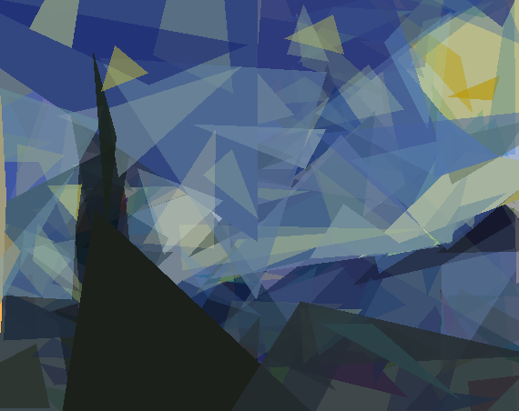

# Genetic Art Algorithm

This is the code that goes with the blog post [here](http://blog.4dcu.be/programming/2020/01/12/Genetic-Art-Algorithm.html).
A genetic algorithm is used to morph 150 random triangles into something resembling Van Gogh's The Starry Night. You can
see the progression from the 1 generation to generation 4500 below.


The final result after 5000 generations you can check out below



Note that running this code will take a long time, all 5000 generations took about 10 hours on my machine.

## Running the code

To run the code in this repository clone it, set up a virtual environment and install the required packages from requirements.txt

```bash

git clone https://github.com/4dcu-be/Genetic-Art-Algorithm
cd Genetic-Art-Algorithm
python -m venv venv
source venv/bin/activate
pip install -r requirements.txt

```

Next you can run evolve.py and evolve_simple.py using

```bash

python evolve.py
# or
python evolve_simple.py

```

The paths to the target image and output directory are hard-coded, but can easily be changed. the lines are in the main
routine.

```python
    target_image_path = "./img/starry_night_half.jpg"
    checkpoint_path = "./starry_night2/"
```

